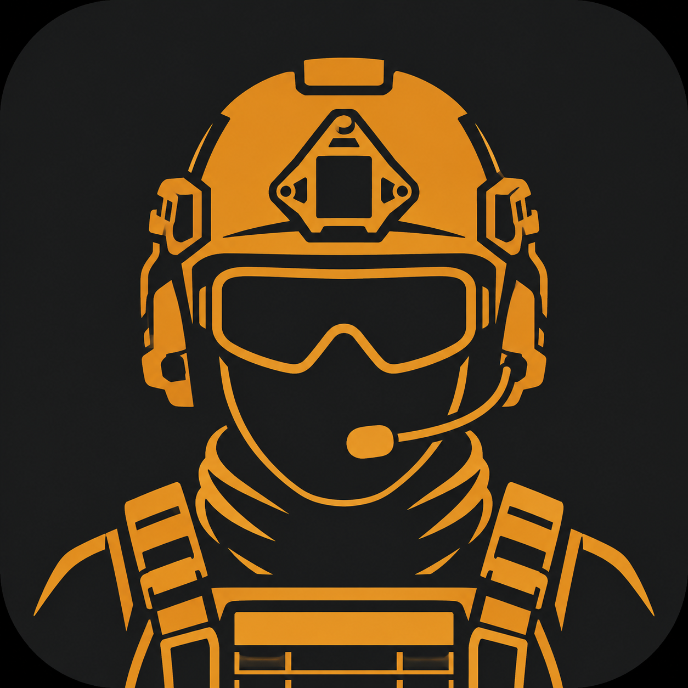

<div align="center">



# Tarkov Helper

Помощник для Escape from Tarkov: подсказывает прямо в рейде, нужен ли предмет
для квестов, убежища или обменов, и ведёт список «что ещё собрать».

</div>

## 📥 Скачать

**[Скачать TarkovHelper.exe (последний релиз)](https://github.com/incub42-spec/TarkovHelper/releases/latest)** —
установка не нужна: один файл, скачал и запустил (Windows 10/11).
При первом запуске SmartScreen может предупредить о неизвестном издателе —
«Подробнее» → «Выполнить в любом случае».

## ⚠️ Статус обкатки

Проверку боем прошли **сканирование предметов (F9)** и **сканирование убежища
(F10)** — уровни всех станций считались верно. Ещё обкатывается:

- **авто-отметка квестов по логам** и актуальность списка квестов.

Если что-то распозналось или отметилось неверно — это можно поправить руками
во вкладках «Квесты» и «Убежище», а баг-репорты (скриншот + что ожидалось)
очень приветствуются в Issues.

## Как это работает и почему это безопасно

Приложение **не читает память игры, ничего не инжектит и не трогает трафик** —
только пассивно делает скриншот области экрана возле курсора и распознаёт текст
встроенным в Windows OCR (как RatScanner). Тем не менее, любой сторонний софт
формально используется на свой страх и риск.

## Как пользоваться

Наведи курсор на предмет, **дождись, пока игра покажет его подпись** (тултип
с названием) — и только тогда жми **F9**. Это главное правило: сканер в первую
очередь читает именно тултип, и по нему распознавание самое точное. Если нажать
раньше, чем подпись появилась, программе останется лишь мелкий текст на ячейках
инвентаря, и она может назвать соседний предмет или честно ответить, что
названия в кадре нет.

Окно осмотра предмета (двойной клик) распознаётся так же хорошо — там название
крупное и всегда на виду.

Подсказка держится десять секунд, и внизу неё идёт тонкая полоска — видно,
сколько времени осталось. Убрать раньше можно **наведя на неё курсор или
щёлкнув любой кнопкой мыши**, ждать не обязательно.

Клавиши можно переназначить: **Настройки → Горячие клавиши** → нажми кнопку
и затем любую клавишу **или кнопку мыши** (колёсико, боковые). Боковая кнопка
мыши удобнее всего: не надо тянуться к клавиатуре, разбирая лут. Левая и правая
кнопки недоступны намеренно — они заняты стрельбой и прицеливанием.

### Сканирование убежища (F10)

Станции считываются **по одной**, а не все разом:

1. Щёлкни **левой кнопкой** по станции в нижней панели убежища — откроется её окно.
2. **Не убирая курсор со станции**, нажми **F10**.
3. Так по очереди с каждой станцией.

Программа читает две области — плитку под курсором и окно открытой станции —
и сохраняет уровень, только если обе показали одну и ту же станцию. Если курсор
увести на соседнюю плитку, она об этом скажет и **ничего не запишет**, так что
неверных данных в профиле не появится.

Уровень берётся из надписи «УРОВЕНЬ N» внизу окна: это вкладка *следующего*
уровня, построенный на единицу меньше. У станции, прокачанной до предела,
такой надписи нет — игра пишет, что станция максимального размера.

Станции, которых в панели вообще нет, **достраиваются сами**. Например «Стена»
пропадает из списка у тех, кто уже прошёл сквозь неё, — но тренажёрный зал,
стенд со снаряжением и уголок боевой славы требуют её 6 уровня, поэтому
наличие любого из них означает, что стена достроена. То же правило работает и
для остальных станций: если что-то построено, значит построено и всё, что для
этого требовалось. Если станцию всё же нужно отметить руками, нажми зелёную
галочку (или красный крестик) слева от её названия во вкладке «Убежище».

### Сканирование квестов (F11)

Игра **нигде не хранит на диске**, какие квесты сданы: в логах есть только
уведомления о сдаче, и те живут недолго. Поэтому историю приходится читать
с экрана — и пока она не прочитана, программа считает сданные квесты
доступными, отчего её список длиннее игрового. Насколько длиннее, видно
под списком во вкладке «Квесты».

1. Открой у торговца вкладку **«Задания»**.
2. Нажми **F11** — программа прочитает левую колонку со списком.

Статус игра пишет в той же строке справа от названия, и он учитывается:
«завершено» отмечает квест сданным, «активно!» — наоборот, **снимает**
ошибочную отметку, если она была. Заодно достраивается цепочка: раз торговец
квест выдал, все предыдущие в цепочке сданы.

Чтобы прочитать историю целиком, включи галочку **«Завершенные»** и жми F11,
прокручивая список: отметки накапливаются, за кадр влезает 15–20 строк.
Откатить всю пачку можно кнопкой «Откатить сканирование» во вкладке «Квесты».

**Shift+F11 — сверка со списком игры.** Список без галочки «Завершенные» —
это ровно те квесты, которые торговец сейчас предлагает. Значит всё, что
программа считает доступным, а игра не показала, уже сдано: Shift+F11
отмечает такие квесты сданными одним движением. Список при этом должен быть
виден целиком (без прокрутки); если хоть одна строка не распозналась, сверка
отменяется — иначе непрочитанный квест уехал бы в «сдано».

## Возможности

- **Оверлей (F9)** — навёл курсор на предмет в рейде, дождался тултипа с
  названием (или открыл окно осмотра), нажал F9 → возле курсора появляется подсказка:
  - для каких квестов нужен и сколько штук (и нужен ли «найден в рейде» / FIR);
  - для каких уровней убежища и сколько;
  - в каких обменах участвует;
  - если не нужен — так и напишет, плюс примерная цена барахолки.
- **Сортировка по любому столбцу** — клик по заголовку в списках «Что собирать»
  и «Квесты» сортирует по нему, повторный клик разворачивает порядок; стрелка
  в заголовке показывает, по какому столбцу и в какую сторону. Числовые
  столбцы («Для квестов», цены, «Уровень») сортируются по числу, а не по
  подписи, поэтому «×10» не оказывается перед «×2».
- **Что собирать** — сводный список всех предметов, которые ещё нужны для
  невыполненных квестов и непостроенных уровней убежища. В колонке «Убежище»
  в скобках — сколько нужно для построек, доступных **прямо сейчас**: у станций
  своя последовательность, и часть предметов понадобится только через несколько
  уровней. В подсказке оверлея такие строки идут ниже и приглушены.
- **Цепочки квестов** — в основном списке только те, что можно взять сейчас:
  сданы все предыдущие квесты цепочки, хватает уровня персонажа и выполнены
  условия торговца. Уровни лояльности и репутация вводятся кнопкой
  «Торговцы…» — без них список расходится с игрой: часть заданий выдаётся
  только при своей репутации, иногда отрицательной (цепочка «Возмещение
  ущерба» у Скупщика). Полный список, включая закрытые и выполненные, — по
  кнопке «Все квесты…». Справа видно описание выбранного квеста, его задачи
  и чего не хватает для доступа; сверху — вкладки торговцев.
  Предметы для закрытых квестов помечаются «позже» в списке «Что собирать»
  и приглушаются в подсказке оверлея, как и предметы для дальних уровней
  убежища.
- **Квесты** — список всех квестов с отметкой выполнения (поиск, фильтр) и
  колонкой фракции. Выполненные открываются кнопкой «Выполненные…» в отдельном
  окне — их сотни, и в общем списке они только мешают; там же можно снять
  отметку, если что-то отмечено по ошибке. У части квестов в игре две версии — для USEC и для BEAR,
  с одинаковым названием и торговцем: выглядит как дубликат в списке. Укажите
  фракцию персонажа в шапке — чужие версии пропадут и из списка, и из подсчёта
  нужного лута. Пока фракция не выбрана, показываются обе, чтобы ничего не
  спрятать молча. Название квеста можно задать своё — правая кнопка мыши по
  строке → «Переименовать квест…». Это для квестов, которых ещё нет ни в
  локалях, ни на русской вики: их название видно только в самой игре. Своё
  название хранится в профиле и переживает обновление базы.
- **Убежище** — уровни станций и то, откуда каждый взялся: зелёная галочка с
  датой — проверено сканом или руками; янтарное «≈» — уровень не увиден, а
  выведен из построек других станций (значит «не ниже», может быть и выше);
  красный крестик — ещё неизвестно. Нажатие на значок подтверждает текущее
  значение вручную.
- **Профили персонажей** — в шапке выбор профиля и метка режима: **PvE**
  (зелёная) или **PvP** (оранжевая). У каждого персонажа свой прогресс и своя
  база: наборы квестов и цены у режимов разные.
- **Обновление из приложения** — версия проверяется при каждом запуске,
  обновиться можно кнопкой в настройках, не скачивая файл вручную.
- **Настраиваемые горячие клавиши** — F9 и F10 можно переназначить на любую
  клавишу или на кнопку мыши (колёсико, боковые). Кнопки мыши читаются через
  системный Raw Input (тот же механизм, что у push-to-talk в мессенджерах) —
  это пассивная подписка на события, без перехвата ввода и вмешательства в игру.
- **Авто-отметка квестов (экспериментально)** — если указать папку игры,
  приложение следит за логами EFT (`<игра>\Logs`) и пытается отмечать
  завершённые квесты автоматически. Формат логов не документирован и меняется
  между патчами, поэтому строки-кандидаты дополнительно пишутся в
  `%AppData%\TarkovHelper\logwatch-debug.log` — по нему разбор можно
  откалибровать. Ручная отметка работает всегда.

## Данные

База предметов, квестов, обменов и убежища берётся с
[tarkov.dev](https://tarkov.dev) и кешируется в `%AppData%\TarkovHelper\`
отдельно для каждого режима: `data-pve.json` и `data-pvp.json` — наборы квестов
и цены у PvE и PvP разные. Обновляется автоматически раз в сутки или кнопкой
в настройках.

Основной путь загрузки — **сырые дампы `json.tarkov.dev`** (обновляются
ежедневно). GraphQL API tarkov.dev, который был основным источником изначально,
не отвечает с июля 2026 года; попытка через него остаётся первой, но фактически
работает резерв (`Services/FallbackDataClient.cs`).

Русские названия собираются из нескольких источников: то, что есть в открытых
зеркалах локализации, дополняется **переводами со вкладки языков фанатской
вики** (`Services/WikiTitles.cs`, кешируется в `wiki-names.json`). Так покрыто
509 из 517 квестов и 4533 из 4931 предмета; остальные остаются с английскими
названиями — это не ошибка загрузки. Дополнительные источники необязательны:
если какой-то из них исчезнет, база продолжит собираться без него.

Прогресс и настройки хранятся в `%AppData%\TarkovHelper\progress.json` —
там же лежат профили персонажей.

## Запуск

Проще всего — скачать exe из [релизов](https://github.com/incub42-spec/TarkovHelper/releases/latest)
и запустить: он самодостаточный, .NET ставить не нужно.

Для сборки из исходников нужен .NET 8 SDK:

```bash
dotnet publish TarkovHelper -c Release -r win-x64 --self-contained true -p:PublishSingleFile=true
```

Готовый файл появится в `TarkovHelper\bin\Release\net8.0-windows10.0.19041.0\win-x64\publish\`.
Не запускайте приложение через `dotnet run` из терминала: при закрытии терминала
процесс завершится вместе с ним — используйте exe или ярлык на него.

## Требования и ограничения

- Windows 10 19041+ (используется встроенный Windows OCR).
- Для распознавания русских названий нужен русский языковой пакет Windows
  (обычно уже установлен), для английского клиента игры — английский.
- Игра должна быть в оконном/borderless режиме, иначе оверлей не виден поверх неё.
- На мультимониторных конфигурациях с разным DPI подсказка может появляться
  с небольшим смещением.
- Счётчик квестовых предметов для целей с альтернативами («любой из…»)
  считает каждый вариант отдельно.

## Структура

- `TarkovHelper/Services/FallbackDataClient.cs` — загрузка базы с json.tarkov.dev (основной путь);
- `TarkovHelper/Services/TarkovDevClient.cs` — загрузка через GraphQL tarkov.dev (сейчас не отвечает);
- `TarkovHelper/Services/WikiTitles.cs` — русские названия с фанатской вики;
- `TarkovHelper/Services/NeededItemsIndex.cs` — индекс «предмет → зачем нужен» с учётом прогресса;
- `TarkovHelper/Services/ScreenOcr.cs` — захват экрана (GDI) + Windows OCR;
- `TarkovHelper/Services/ItemMatcher.cs` — нечёткое сопоставление распознанного текста с базой;
- `TarkovHelper/Services/HideoutScanner.cs` — разбор экрана убежища (F10);
- `TarkovHelper/Services/HideoutInference.cs` — уровни станций по условиям постройки;
- `TarkovHelper/Services/LogWatcher.cs` — слежение за логами игры;
- `TarkovHelper/Services/UpdateService.cs` — проверка и установка обновлений;
- `TarkovHelper/Overlay/OverlayWindow.xaml` — прозрачный оверлей с горячими клавишами;
- `TarkovHelper/MainWindow.xaml` — вкладки «Что собирать», «Квесты», «Убежище», «Настройки».

Технические выводы и наблюдения по игре и распознаванию — в [NOTES.md](NOTES.md),
задумки на будущее — в [IDEAS.md](IDEAS.md).

## Лицензия

[GPL-3.0](LICENSE). Программа предоставляется «как есть», без каких-либо гарантий:
автор не несёт ответственности за последствия её использования.

## Правовая оговорка

Неофициальный фанатский инструмент. Проект **не связан с Battlestate Games,
не одобрен и не поддерживается ею**. «Escape from Tarkov» и связанные названия —
товарные знаки Battlestate Games Limited; они используются здесь исключительно
для указания на игру, с которой работает программа.

Игровые ресурсы (иконки, тексты, арты) в проект не входят: иконка приложения
создана самостоятельно, игровые данные берутся из открытых источников сообщества
(tarkov.dev, SPT, TarkovLab). Используйте инструмент на свой страх и риск.
